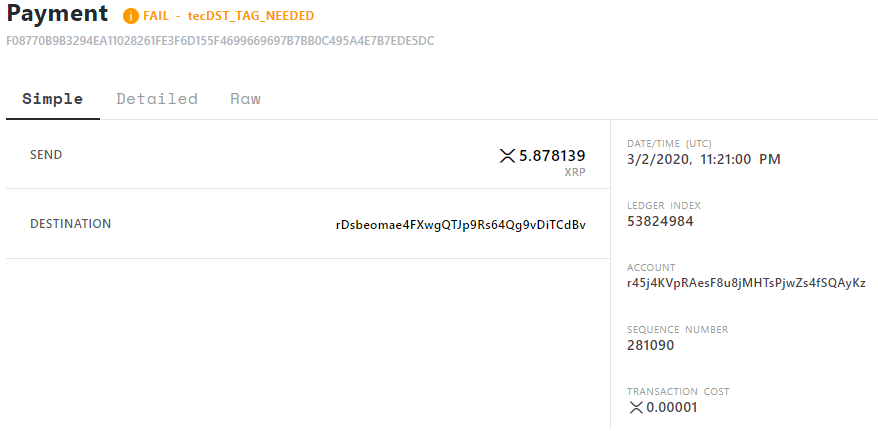

# Ripple Transaction Failure

In this example a Ripple team member has been notified of repeated transaction failures from a specific user due to lack of destination tags. How should the Ripple team member reach out to the user?

Below is the simple, detailed, and raw JSON explanation of one of the transactions. 

| [Simple](https://livenet.xrpl.org/transactions/F08770B9B3294EA11028261FE3F6D155F4699669697B7BB0C495A4E7B7EDE5DC/simple) | [Detailed](https://livenet.xrpl.org/transactions/F08770B9B3294EA11028261FE3F6D155F4699669697B7BB0C495A4E7B7EDE5DC/detailed) | [Raw JSON](https://livenet.xrpl.org/transactions/F08770B9B3294EA11028261FE3F6D155F4699669697B7BB0C495A4E7B7EDE5DC/raw)|
| ------ | ------ | ------ |
|  |   |  |      

### Example Email Hosted On Webpage:

This is an example of how a Ripple team member could successfully amend the issue. 
--

